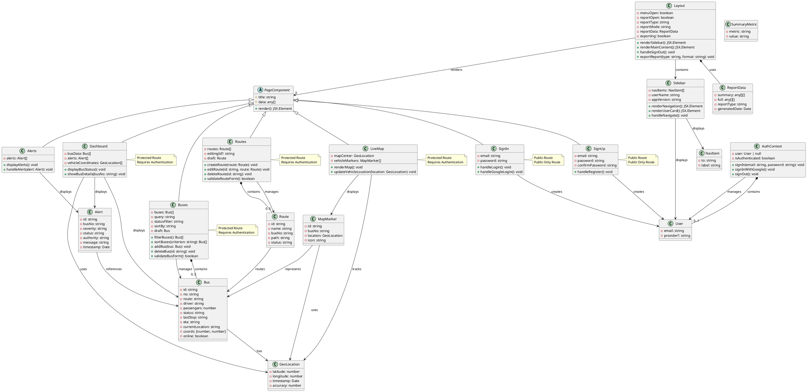

# Bus Tracker Admin Panel - UML Class Diagram

## PlantUML Diagram



## Architecture Overview

### Component Hierarchy

```
App (Router)
├── Public Routes
│   ├── SignIn
│   └── SignUp
└── Protected Routes
    └── Layout
        ├── Sidebar
        └── MainContent
            ├── Dashboard
            ├── Buses
            ├── Routes
            ├── Alerts
            └── LiveMap
```

### State Management

- **AuthContext**: Manages user authentication state globally
- **Local State**: Each page component manages its own data (buses, routes, alerts)
- **Memoization**: Used for computed values (filtered/sorted data, summaries)

### Key Data Models

| Model | Purpose | Key Fields |
|-------|---------|-----------|
| **User** | Authentication | email, provider |
| **Bus** | Vehicle tracking | id, route, driver, status, coordinates, passengers |
| **Route** | Trip planning | id, name, busNo, path, status |
| **Alert** | Notifications | id, busNo, severity, status, authority |
| **GeoLocation** | GPS data | latitude, longitude, timestamp, accuracy |

### Features

1. **Authentication**: Sign in/up with email or Google
2. **Dashboard**: Real-time bus status, alerts, and metrics
3. **Fleet Management**: View and manage buses
4. **Route Management**: Create, edit, and manage routes
5. **Alerts System**: Monitor and respond to bus alerts
6. **Live Map**: Track vehicle locations in real-time
7. **Reporting**: Generate and export operational reports

---

*Diagram generated for Bus Tracker Admin Panel v0.0.0*
